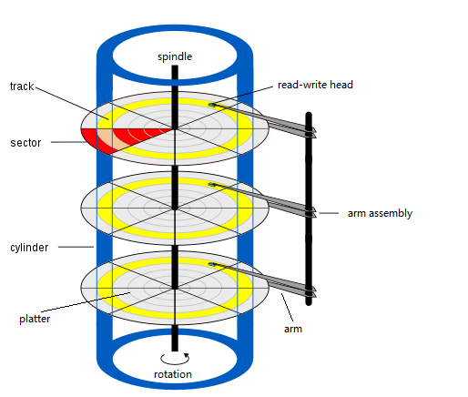

# CHS Addressing

## Key Topics

+ [Definition and Components](#definition-and-components)
+ [CHS Addressing Formulae and Conversions](#chs-addressing-formulae-and-conversions)
+ [Historical Parameters, Limits, and BIOS Conventions](#historical-parameters-limits-and-bios-conventions)
+ [Practical Examples](#practical-examples)
+ [Use Case](#use-case)
+ [Advantages and Disadvantages of CHS](#advantages-and-disadvantages-of-chs)

---

## Definition and Components

CHS (Cylinder-Head-Sector) is a scheme to address individual sectors (physical blocks) on a hard disk using three coordinates:

* **Cylinder (C):** A cylinder corresponds to a set of tracks at the same radius on all platters. Each platter has two surfaces (heads), so the heads at a given track height across all platters collectively define a cylinder.
* **Head (H):** The read/write head selecting which platter side (surface) you are accessing. Since each platter has two sides, each side has one head. The head number identifies which surface is being addressed.
* **Sector (S):** A physical subdivision of a track into segments; each sector is the smallest addressable unit. Early systems often used 512 bytes per sector. Sectors are numbered starting from 1.

These three values (C, H, S) uniquely locate a sector on disk in the CHS model.

---

## CHS Addressing Formulae and Conversions

To map between CHS and LBA (Logical Block Addressing) you use standard arithmetic formulae. These are central in bootloaders, BIOS disk services, partition tables, etc.

Let:

* $C$ = cylinder number (from 0 up to some max)
* $H$ = head number (from 0 up to heads\_per\_cylinder − 1)
* $S$ = sector number (from 1 up to sectors\_per\_track)
* $\mathrm{HPC}$ = number of heads per cylinder
* $\mathrm{SPT}$ = number of sectors per track
* $\mathrm{LBA}$ = linear block (sector) number, starting from 0

### CHS → LBA conversion:

$$
\mathrm{LBA} = \bigl(C \times \mathrm{HPC} + H\bigr) \times \mathrm{SPT} + (S - 1)
$$

Meaning: first count how many heads full cylinders contribute, add the head, multiply by sectors per track, then add (sector − 1) because sectors start from 1.

### LBA → CHS conversion:

$$
\begin{aligned}
C &= \left\lfloor \frac{\mathrm{LBA}}{\mathrm{HPC} \times \mathrm{SPT}} \right\rfloor \\
H &= \left( \left\lfloor \frac{\mathrm{LBA}}{\mathrm{SPT}} \right\rfloor \bmod \mathrm{HPC} \right) \\
S &= (\mathrm{LBA} \bmod \mathrm{SPT}) + 1
\end{aligned}
$$

Here, integer division and modulo operations are used. Sector is offset by +1 because CHS sectors number from 1.

---

## Historical Parameters, Limits, and BIOS Conventions

* Typical BIOS CHS limits include a maximum of **1023 cylinders**, **255 heads**, and **63 sectors per track**, with sectors being usually sized at 512 bytes.

* Using those maximum values, the capacity addressable under CHS is bounded. For example:

  $$
  \text{Max capacity} \approx 1023 \times 255 \times 63 \times 512\ \text{bytes} \approx 8.4\ \text{gigabytes}
  $$

  This limit was one reason CHS became inadequate for larger disks.

* CHS parameters are exposed via BIOS (especially with INT 13h services), partition tables (MBR), etc. Many utilities still interpret CHS fields for legacy compatibility though these values are often logical/emulated rather than mapping the physical disk geometry.

---

## Practical Examples

### Example 1: Converting a given CHS to LBA

Suppose a disk has:

* HPC = 16 heads
* SPT = 63 sectors per track

Given CHS = (C = 0, H = 1, S = 1):

$$
\mathrm{LBA} = (0 \times 16 + 1) \times 63 + (1 - 1) = 1 \times 63 + 0 = 63
$$

So sector number 63 in LBA.

### Example 2: LBA to CHS

Take LBA = 1234, same disk geometry (HPC = 16, SPT = 63):

$$
C = \lfloor 1234 / (16 \times 63) \rfloor = \lfloor 1234 / 1008 \rfloor = 1  
$$

$$
H = (\lfloor 1234 / 63 \rfloor \bmod 16) = (19 \bmod 16) = 3  
$$

$$
S = (1234 \bmod 63) + 1 = (34) + 1 = 35  
$$

So CHS = (1, 3, 35).

---

## Use Case

* BIOS’ **INT 13h** calls historically used CHS addressing for disk reads/writes. Early bootloaders and firmware depended on these.
* As drives grew and BIOSes evolved, INT 13h was extended (“INT 13h Extensions”) to support LBA addressing. If the drive or BIOS doesn’t support LBA, BIOS may convert LBA requests into CHS behind the scenes.

---

## Advantages and Disadvantages of CHS

### Advantages

* Simple, matches physical geometry in early disk designs.
* Straightforward to visualize: “which platter side, which track, which sector” maps neatly.
* Works on older hardware / BIOS without BIOS LBA extensions.

### Disadvantages

* Severe capacity limits. As disk designers increased platters, track density, etc., CHS’s maximum capacity ceiling became inadequate.
* Physical geometry abstraction: many modern disks do not have constant sectors per track (outer vs inner tracks differ), are zoned, or have heads/platters internally abstracted, so the CHS values provided by BIOS or firmware are often fake/emulated.
* Complexity & inefficiency: mapping filesystem logical blocks using CHS is cumbersome; LBA is simpler.
* Limits in BIOS and partition table representation try to squeeze CHS parameters into bit fields: e.g. in the MBR partition table CHS fields are only 3 bytes and limited. This imposes additional software/firmware constraints.

---
