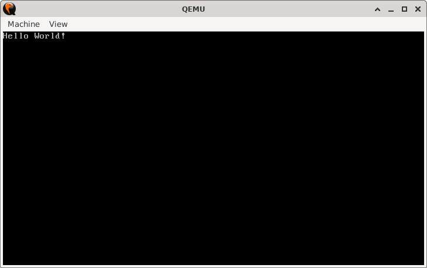

# Hello World

> **Random Quote**: A hero is an ordinary individual who finds the strength to persevere and endure in spite of overwhelming obstacles.

## Sections

+ [Overview](#overview)
    - [Objectives](#objectives)
+ [How It Works](#how-it-works)
+ [Practice Areas](#practice-areas)
+ [Running the Project](#running-the-project)
+ [Output and Explanation](#output-and-explanation)

---

## Overview

This project implements a minimal bootloader that sets up a stack, prints the message "Hello World!" on the screen using BIOS interrupts, and halts execution. It demonstrates the fundamentals of boot sector programming while adhering to the strict 512-byte bootloader format.

### Objectives

+ Explicitly specify the memory address (`0x7C00`) where the bootloader is loaded by the BIOS.  
+ Initialize the stack in a secure memory region.  
+ Use BIOS interrupts to display the string "Hello World!".  
+ Ensure the bootloader size is exactly 512 bytes.  
+ Include the mandatory boot signature (`0xAA55`).  

---

## How It Works

1. The BIOS loads the boot sector into memory at physical address `0x7C00`.  
2. The video mode is set to `80x25` text mode (`INT 10h, AH=0x00`).  
3. The stack segment (`SS`) is initialized to `0x0000`, and the stack pointer (`SP`) is positioned at `0x7C00`.  
4. The string "Hello World!" is loaded character by character from memory.  
5. Each character is displayed using BIOS teletype output (`INT 10h, AH=0x0E`).  
6. When the terminating null byte (`0`) is reached, the CPU halts execution (`HLT`) after disabling interrupts (`CLI`).  
7. The boot sector is padded with zeros until byte 510, followed by the boot signature (`0xAA55`) to mark it as bootable.  

---

## Practice Areas

+ Understanding the memory layout and boot sector placement at `0x7C00`.  
+ Initializing the stack properly in real mode.  
+ Using BIOS interrupts (`INT 10h`) for screen output.  
+ Implementing string printing logic with `LODSB` and loop control.  
+ Constructing a valid boot sector with the `0xAA55` signature.  

---

## Running the Project

To run the bootloader, execute the `run.sh` script.

```sh
./run.sh
```

This script uses `NASM` to assemble `main.asm` into a bootable flat binary (`main.img`) and launches it in QEMU for testing.

---

## Output and Explanation

Output:



Explanation:
The bootloader correctly initializes video mode and the stack, iterates through the string stored in memory, and prints each character to the screen using BIOS interrupts. After the message is displayed, the program halts, confirming proper bootloader behavior within 512 bytes.

---
