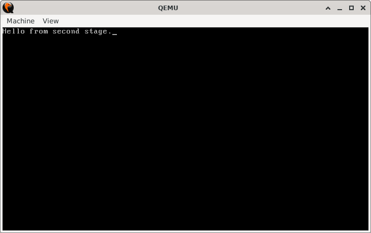
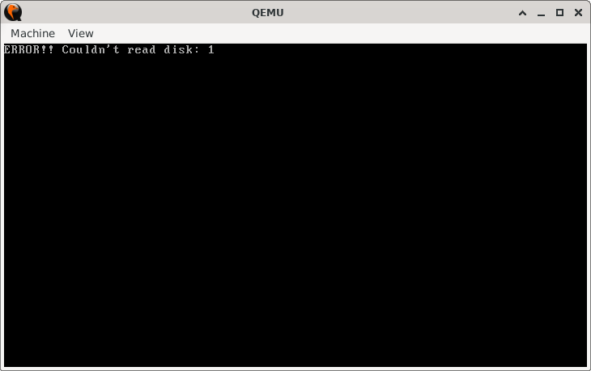

# CHS Bootloader Project

## Sections

+ [Overview](#overview)
    - [Objectives](#objectives)
+ [How It Works](#how-it-works)
+ [Practice Areas](#practice-areas)
+ [Running the Project](#running-the-project)
+ [Output and Explanation](#output-and-explanation)
+ [Notes](#notes)

---

## Overview

This project demonstrates a two-stage bootloader system using CHS (Cylinder-Head-Sector) addressing. The first stage loads the second stage from disk and transfers control, showcasing fundamental bootloader mechanics.

### Objectives

+ Implement a first-stage bootloader that reads from disk using CHS addressing
+ Load a second-stage bootloader into memory at `0x7E00`
+ Successfully hand off execution between stages
+ Handle disk errors gracefully with meaningful output

---

## How It Works

1. **First Stage Execution (0x7C00):**

   - Initializes segments, stack pointer, and clears the screen
   - Uses BIOS interrupt `INT 13h AH=02h` to read sector 2 from disk
   - Loads the second stage at memory address `0x7E00`
   - On success: Jumps to second stage via far jump `jmp 0x0000:0x7E00`
   - On error: Displays error code and halts

2. **Second Stage Execution (0x7E00):**

   - Displays confirmation message "Hello from second stage."
   - Enters infinite halt loop to prevent further execution

3. **Memory Layout:**

   - First Stage: `0x7C00-0x7DFF` (512 bytes)
   - Second Stage: `0x7E00-0x7FFF` (512 bytes)
   - Stack: Grows downward from `0x7C00`

---

## Practice Areas

+ **CHS Disk Addressing:** Using cylinder, head, and sector parameters
+ **BIOS Interrupt Services:** `INT 13h` for disk operations, `INT 10h` for video
+ **Memory Management:** Segment:offset addressing in real mode
+ **Error Handling:** Checking carry flag and displaying error codes
+ **Bootloader Structure:** Proper organization and boot signature
+ **Stage Handoff:** Far jumping between memory segments

---

## Running the Project

Execute the provided build script to assemble the bootloaders and launch the emulator:

```bash
chmod +x run.sh
./run.sh

# Alternative if execute permissions are unavailable:
bash run.sh
```

The script performs the following automated steps:

1. **Assembly:** Compiles `first_stage.asm` and `second_stage.asm` into raw binaries using NASM (`first_stage.bin` and `second_stage.bin`)
2. **Disk Image Creation:** Generates a 2-sector disk image (`disk.img`) 
3. **Sector Placement:** 
   - Writes `first_stage.bin` to the master boot record (sector 0)
   - Writes `second_stage.bin` to the subsequent sector (sector 1)
4. **Emulation:** Launches QEMU with the completed disk image

This streamlined process ensures proper sector alignment and boot signature placement for immediate testing.

---

## Output and Explanation

**Successful Execution:**



*The second stage message confirms successful disk read and execution handoff.*

**Error Scenario:**



Error code 01 ("Invalid command or parameter") occurs when BIOS receives invalid register values during a disk operation. While `DL=0x80` correctly specifies the first hard drive, this caused an error because QEMU was treating the disk image as a floppy disk (`-fda`). Since no hard drive was available in this configuration, the BIOS call failed.

**Resolution Options:**

1. **Configure QEMU for HDD Emulation:**
   ```bash
   qemu-system-x86_64 -drive file=disk.img,format=raw
   ```
   This explicitly treats `disk.img` as a hard disk drive, making drive `0x80` available.

2. **Use Floppy Disk Addressing:**
   Change the drive parameter in your bootloader to `DL=0x00` to access the first floppy drive, matching QEMU's original configuration.

---

## Notes

+ **CHS Limitations:** This method is limited to traditional disk geometries and may not work on modern storage devices without proper translation
+ **Memory Alignment:** The second stage is loaded at `0x7E00` to avoid overwriting the first stage at `0x7C00`
+ **Error Codes:** BIOS disk errors provide specific failure reasons - essential for debugging real hardware issues
+ **Sector Numbering:** CHS uses 1-based sector numbering (sector 2 = LBA 1)
+ **Boot Signature:** The first stage must end with `0xAA55` at bytes 510-511 to be recognized as bootable

---
