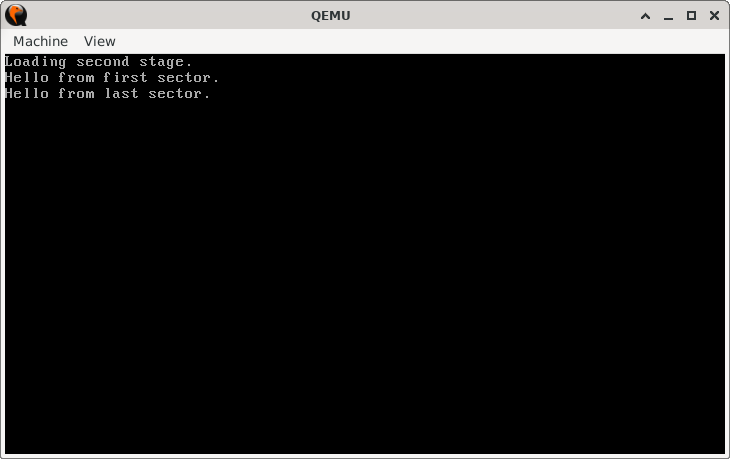

# LBA Second Stage Bootloader

## Sections

+ [Overview](#overview)
    - [Objectives](#objectives)
+ [How It Works](#how-it-works)
+ [Practice Areas](#practice-areas)
+ [Running the Project](#running-the-project)
+ [Output and Explanation](#output-and-explanation)
+ [Notes](#notes)

---

## Overview

This project implements a two-stage bootloader system where the first stage uses LBA (Logical Block Addressing) to load a large 64 KB second stage into memory, demonstrating advanced bootloader techniques beyond basic CHS addressing.

### Objectives

+ Implement LBA disk reading using the BIOS Extended Read Service (`INT 13h AH=42h`)
+ Load a precisely sized 64 KB second-stage bootloader into high memory
+ Demonstrate multi-sector disk reading with proper memory management
+ Verify successful handoff between boot stages with sector-specific messaging

---

## How It Works

### First Stage (Boot Sector)

1. **Initialization**: Sets up segments, stack, and clears the screen
2. **LBA Configuration**: Prepares a Disk Address Packet (DAP) for extended read operations
3. **Multi-Sector Loading**: Reads 64 sectors (32 KB) per iteration across two cycles to load 128 total sectors (64 KB)
4. **Memory Management**: Increments segment pointers between read operations to avoid memory overlap
5. **Execution Transfer**: Jumps to the loaded second stage at `0x1000:0x0000`

### Second Stage (64 KB Image)

1. **Memory Layout**: Organized with executable code in the first and last 512-byte sectors
2. **Sector Verification**: First sector prints an initialization message, last sector prints a completion message
3. **Structural Integrity**: Middle sectors padded with zeros to maintain exact 64 KB size
4. **Progressive Execution**: Code flows from first sector to last sector via direct jump

---

## Practice Areas

+ **LBA Disk Access**: Using BIOS Extended Read Service with Disk Address Packets
+ **Multi-Sector Loading**: Reading large blocks of data across multiple BIOS calls
+ **Memory Management**: Proper segment arithmetic for large memory transfers
+ **Bootloader Staging**: Designing and implementing multi-stage boot processes
+ **Binary Structure**: Creating precisely sized disk images with specific memory layouts
+ **Real-mode Programming**: Segment:offset addressing and BIOS service utilization

---

## Running the Project

Execute the provided build script to assemble the bootloaders and launch the emulator:

```bash
chmod +x run.sh
./run.sh

# Alternative if execute permissions are unavailable:
bash run.sh
```

The script performs the following automated steps:

1. **Assembly:** Compiles `first_stage.asm` and `second_stage.asm` into raw binaries using NASM (`first_stage.bin` and `second_stage.bin`)
2. **Disk Image Creation:** Generates a 129-sector disk image (`disk.img`) initialized with zeros
3. **Sector Placement:** 
   - Writes `first_stage.bin` to the master boot record (sector 0)
   - Writes the 64 KB `second_stage.bin` starting at sector 1 (128 sectors total)
4. **Emulation:** Launches QEMU i386 with the completed disk image
5. **Cleanup:** Removes all generated binaries and the disk image after execution

This process ensures the second stage occupies exactly 128 sectors (64 KB) with proper LBA alignment, creating the precise disk structure required by the bootloader's multi-sector reading logic.

---

## Output and Explanation



**Explanation**:
- The first line confirms successful LBA disk reading by the first stage
- The second line verifies execution of code from the second stage's first sector
- The third line confirms proper memory layout and execution flow through the entire 64 KB image

The sequential appearance of all three messages demonstrates complete success: LBA loading worked, the full 64 KB was loaded correctly, and execution properly traversed the memory space.

---

## Notes

+ **LBA Advantages**: Unlike CHS, LBA doesn't require knowledge of disk geometry and can access beyond the first 8 GB of storage
+ **Memory Calculation**: The segment increment `((512 * SECTOR_COUNT) / 16)` correctly advances the memory pointer by 32 KB per read operation
+ **Error Handling**: The first stage includes basic disk error detection but could be enhanced with retry mechanisms
+ **Size Precision**: The second stage uses `times` directives to ensure exact sector alignment and total size
+ **Real-mode Constraints**: All memory addressing remains within the 1 MB real-mode address space

This implementation provides a foundation for loading large kernels or complex boot environments that exceed the limitations of simple boot sector programming.

---
